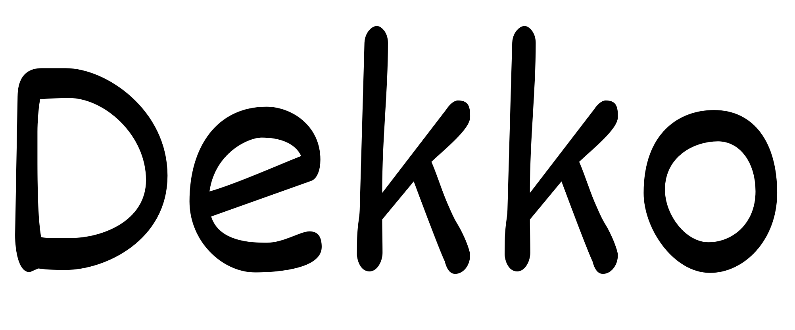
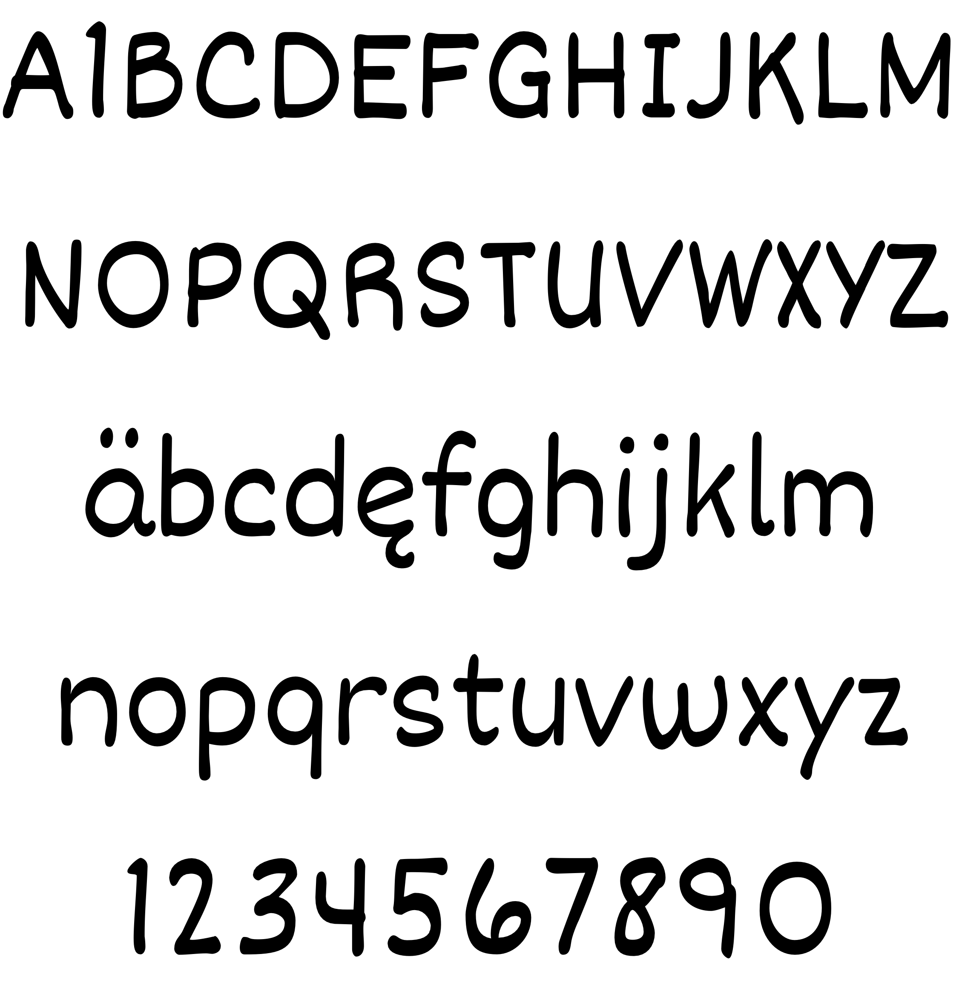
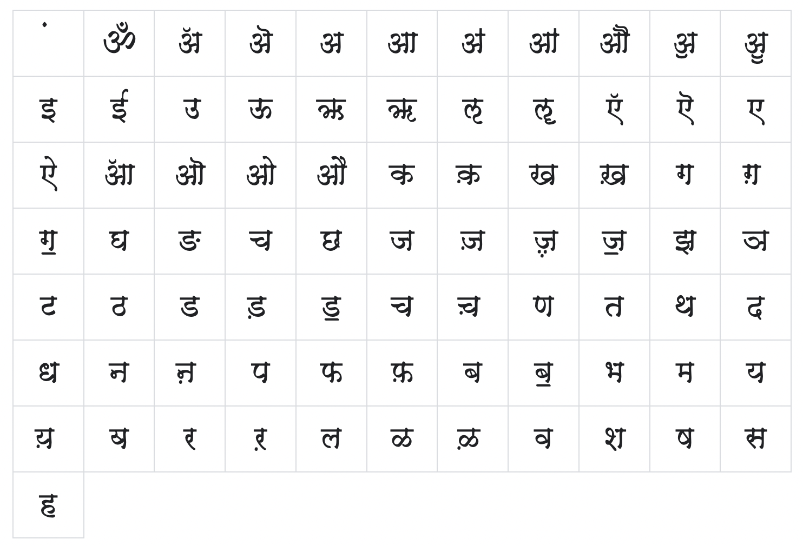

# Denk One

Dekko’s personality is both warm and casual. It originated with Modular InfoTech's 4948, and was modified to feel more written and regular in appearance and weight. The inter-letter spacing of the design is now wider, allowing for it to be used at smaller sizes on screens. Dekko also comes with a complete set of Latin which matches the Devanagari in weight and and size, and originates with Short Stack. Both the Devanagari and the Latin are based on written forms, and their stroke contrast has thick horizontals. The pen angles traditionally associated with Devanagari has some diagonal stress, but here the Latin script uses a vertical stress.

## Authors

N: Eben Sorkin
E: sorkineben@gmail.com
W: www.sorkintype.com
D: Mastering

## Building

Fonts are built automatically by GitHub Actions - take a look in the "Actions" tab for the latest build.

If you want to build fonts manually on your own computer:

* `make build` will produce font files.
* `make test` will run [FontBakery](https://github.com/googlefonts/fontbakery)'s quality assurance tests.
* `make proof` will generate HTML proof files.

## Changelog

When you update your font (new version or new release), please report all notable changes here, with a date.
[Font Versioning](https://github.com/googlefonts/gf-docs/tree/main/Spec#font-versioning) is based on semver. 

**Date + Version**

## License

This Font Software is licensed under the SIL Open Font License, Version 1.1.
This license is available with a FAQ at
https://scripts.sil.org/OFL

## Repository Layout

This font repository structure is inspired by [Unified Font Repository v0.3](https://github.com/unified-font-repository/Unified-Font-Repository), modified for the Google Fonts workflow.
